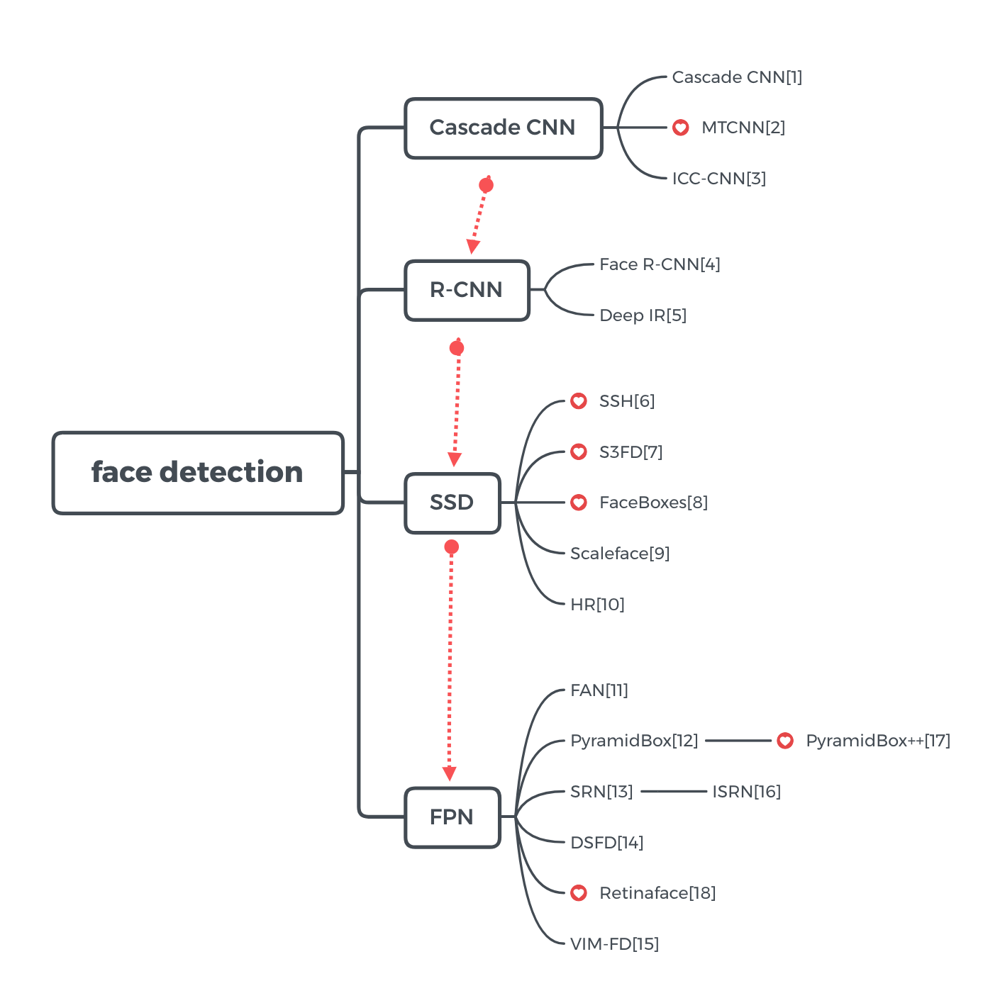
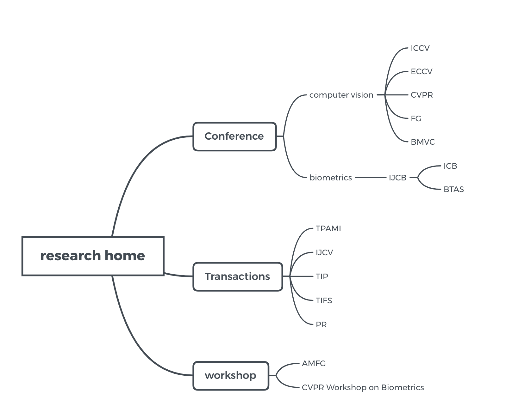

# awesome-face 
🔥  face releated algorithm, datasets and papers  🤔

## 📝 Paper / Algorithm

#### 2D- Face Recognition 

**[1] DeepID1**  [**[paper]**](https://www.cv-foundation.org/openaccess/content_cvpr_2014/papers/Sun_Deep_Learning_Face_2014_CVPR_paper.pdf) 

Deep Learning Face Representation from Predicting 10,000 Classes

**[2] DeepID2**  [**[paper]**](https://arxiv.org/abs/1406.4773) 

Deep Learning Face Representation by Joint Identification-Verification

**[3] DeepID2+**  [**[paper]**](https://arxiv.org/abs/1412.1265)

Deeply learned face representations are sparse, selective, and robust

**[4] DeepIDv3**  [**[paper]**](https://arxiv.org/abs/1502.00873) 

DeepID3: Face Recognition with Very Deep Neural Networks

**[5] Deep Face** [**[paper]**](https://www.robots.ox.ac.uk/~vgg/publications/2015/Parkhi15/parkhi15.pdf) 

Deep Face Recognition

**[6] Center Loss** [**[paper]**](http://ydwen.github.io/papers/WenECCV16.pdf)    [**[code]**](https://github.com/ydwen/caffe-face)

A Discriminative Feature Learning Approach for Deep Face Recognition

**[7]Marginal loss** [**[paper]**](https://www.computer.org/csdl/proceedings-article/cvprw/2017/0733c006/12OmNzayNCT)

Marginal loss for deep face recognition

**[8] Range Loss**[**[paper]**](https://arxiv.org/abs/1611.08976) 

Range Loss for Deep Face Recognition with Long-tail

**[9]Contrastive Loss** [**[paper]**](<https://arxiv.org/abs/1406.4773>)

Deep learning face representation by joint identification-verification

**[10] FaceNet**   [**[paper]**](https://arxiv.org/abs/1503.03832)   [[**third-party implemention**]](https://github.com/davidsandberg/facenet)

FaceNet: A Unified Embedding for Face Recognition and Clustering

**[11] NormFace**  [**[paper]**](https://arxiv.org/pdf/1704.06369.pdf)    [**[code]**](https://github.com/happynear/NormFace)

NormFace: L2 Hypersphere Embedding for Face Verification

**[12] COCO Loss:**    [**[paper]**](https://arxiv.org/pdf/1710.00870.pdf)   [[**code**]](https://github.com/sciencefans/coco_loss)

Rethinking Feature Discrimination and Polymerization for Large-scale Recognition

**[13] Large-Margin Softmax Loss**  [**[paper]**](https://arxiv.org/pdf/1612.02295.pdf)  [[**code**]](https://github.com/wy1iu/LargeMargin_Softmax_Loss)

Large-Margin Softmax Loss for Convolutional Neural Networks(L-Softmax loss)

**[14]SphereFace：**  **A-Softmax**   [**[paper]**](https://arxiv.org/abs/1704.08063)  [[**code**]](https://github.com/wy1iu/sphereface)

SphereFace: Deep Hypersphere Embedding for Face Recognition

**[15]AM-Softmax/cosFace**     [**[paper AM-Softmax]**](https://arxiv.org/pdf/1801.05599.pdf)       [**[paper cosFace]**](https://arxiv.org/pdf/1801.09414.pdf)        [[**AM-softmax code**]](https://github.com/happynear/AMSoftmax)

AM : Additive Margin Softmax for Face Verification

CosFace: Large Margin Cosine Loss for Deep Face Recognition(Tencent AI Lab)

**[16] ArcFace:**  [**[paper]**](https://arxiv.org/pdf/1801.07698.pdf)  [**[code]**](https://github.com/deepinsight/insightface )

ArcFace: Additive Angular Margin Loss for Deep Face Recognition

#### Face Detection

**[1] Cascade CNN**  [**[paper]**](https://ieeexplore.ieee.org/document/7299170/)   [**[code]**](https://github.com/anson0910/CNN_face_detection)    

A Convolutional Neural Network Cascade for Face Detection

**[2] MTCNN**   [**[Paper]**](https://kpzhang93.github.io/MTCNN_face_detection_alignment/)    [**[code]**](https://github.com/kpzhang93/MTCNN_face_detection_alignment)  

Joint Face Detection and Alignment using Multi-task Cascaded Convolutional Networks

**[3] ICC - CNN**  [**[paper]**](https://ieeexplore.ieee.org/document/8237606)

Detecting Faces Using Inside Cascaded Contextual CNN

**[4] Face R-CNN**  [**[Paper]**](https://arxiv.org/pdf/1706.01061.pdf)

Face R-CNN

**[5] Deep-IR**[**[Paper]**](https://arxiv.org/abs/1701.08289)

Face Detection using Deep Learning: An Improved Faster RCNN Approach

**[6] SSH**     [**[paper]**](https://arxiv.org/pdf/1708.03979.pdf)    [**[code]**](https://github.com/mahyarnajibi/SSH)

SSH: Single Stage Headless Face Detector

**[7] S3FD**   [**[paper]**](https://arxiv.org/abs/1708.05237)

Single Shot Scale-invariant Face Detector

**[8] FaceBoxes** [**[paper]**](https://arxiv.org/pdf/1708.05234.pdf)     [**[code]**](https://github.com/sfzhang15/FaceBoxes)

Faceboxes: A CPU Real-time Face Detector with High Accuracy

**[9] Scaleface**     [**[paper]**](http://cn.arxiv.org/abs/1706.02863)

Face Detection through Scale-Friendly Deep Convolutional Networks

**[10] HR**  [**[paper]**](https://arxiv.org/abs/1612.04402)  [**[code]**](https://github.com/peiyunh/tiny)

Finding Tiny Faces

**[11] FAN**   [**[paper]**](https://arxiv.org/abs/1712.00721)

Feature Agglomeration Networks for Single Stage Face Detection.

**[12] PyramidBox**    [**[paper]**](https://arxiv.org/abs/1803.07737?context=cs) [**[code]**](https://github.com/PaddlePaddle/models/blob/develop/fluid/PaddleCV/face_detection/README_cn.md)

PyramidBox: A Context-assisted Single Shot Face Detector

**[13] SRN**     [**[paper]**](https://arxiv.org/abs/1809.02693) 

Selective Refinement Network for High Performance Face Detection.

**[14] DSFD**  [**[paper]**](https://arxiv.org/abs/1810.10220)

DSFD: Dual Shot Face Detector

**[15] VIM FD** [**[paper]**](https://arxiv.org/abs/1901.02350)

Robust and High Performance Face Detector

**[16] ISRN**  [**[paper]**](https://arxiv.org/abs/1901.06651)

Improved Selective Refinement Network for Face Detection

**[17] PyramidBox++**  [**[Paper]**](https://arxiv.org/abs/1904.00386)

PyramidBox++: High Performance Detector for Finding Tiny Face

**[18] RetinaFace**    [**[paper]**](https://arxiv.org/pdf/1905.00641.pdf)  [**[code]**](https://github.com/deepinsight/insightface/tree/master/RetinaFace)

RetinaFace: Single-stage Dense Face Localisation in the Wild

#### Face Alignment

**[1] PRNet**     [**[paper]**](http://openaccess.thecvf.com/content_ECCV_2018/papers/Yao_Feng_Joint_3D_Face_ECCV_2018_paper.pdf)    [**[code]**](https://github.com/YadiraF/PRNet)  

Joint 3D Face Reconstruction and Dense Alignment with Position Map Regression Network

**[2]LAB**   [Paper](https://arxiv.org/abs/1805.10483)    [**[code]**](https://github.com/wywu/LAB)

Look at Boundary: A Boundary-Aware Face Alignment Algorithm

**[3]PFLD**   [Paper](https://arxiv.org/pdf/1902.10859.pdf)    [**[demo code]**](https://sites.google.com/view/xjguo/fld)

PFLD: A Practical Facial Landmark Detector

**[4] 2D & 3D FAN**   [**[Paper]**](https://www.adrianbulat.com/downloads/FaceAlignment/FaceAlignment.pdf)    [**[code]**](https://github.com/1adrianb/face-alignment)

How far are we from solving the 2D & 3D Face Alignment problem? (and a dataset of 230,000 3D facial landmarks)

#### Face attack & Defends

[1] A Dataset and Benchmark for Large-Scale Multi-Modal Face Anti-Spoofing

[2] Deep Tree Learning for Zero-Shot Face Anti-Spoofing

[3] Decorrelated Adversarial Learning for Age-Invariant Face Recognition

[4] Multi-Adversarial Discriminative Deep Domain Generalization for Face Presentation Attack Detection

[5] Efficient Decision-Based Black-Box Adversarial Attacks on Face Recognition

##  ⚙ Open source lib

#### face recognition

- [face.evoLVe.](https://github.com/ZhaoJ9014/face.evoLVe.PyTorch)

- [face_recognition.pytorch](https://github.com/grib0ed0v/face_recognition.pytorch)
-  [insightface](https://github.com/deepinsight/insightface )

#### face detection

- [libfaccedetection](https://github.com/ShiqiYu/libfacedetection)

## 📦 Datasets

#### 2D Face Recognition

| Datasets                   | Description                                                  | Links                                                        | Publish Time |
| -------------------------- | ------------------------------------------------------------ | ------------------------------------------------------------ | ------------ |
| **CASIA-WebFace**          | **10,575** subjects and **494,414** images                   | [Download](http://www.cbsr.ia.ac.cn/english/CASIA-WebFace-Database.html) | 2014         |
| **MegaFace**🏅              | **1 million** faces, **690K** identities                     | [Download](http://megaface.cs.washington.edu/)               | 2016         |
| **MS-Celeb-1M**🏅           | about **10M** images for **100K** celebrities   Concrete measurement to evaluate the performance of recognizing one million celebrities | [Download](http://www.msceleb.org)                           | 2016         |
| **LFW**🏅                   | **13,000** images of faces collected from the web. Each face has been labeled with the name of the person pictured.  **1680** of the people pictured have two or more distinct photos in the data set. | [Download](http://vis-www.cs.umass.edu/lfw/)                 | 2007         |
| **VGG Face2**🏅             | The dataset contains **3.31 million** images of **9131** subjects (identities), with an average of 362.6 images for each subject. | [Download](http://www.robots.ox.ac.uk/~vgg/data/vgg_face2/)  | 2017         |
| **UMDFaces Dataset-image** | **367,888 face annotations** for **8,277 subjects.**         | [Download](http://www.umdfaces.io)                           | 2016         |
| **Trillion Pairs**🏅        | Train: **MS-Celeb-1M-v1c** &  **Asian-Celeb** Test: **ELFW&DELFW** | [Download](http://trillionpairs.deepglint.com/overview)      | 2018         |
| **FaceScrub**              | It comprises a total of **106,863** face images of male and female **530** celebrities, with about **200 images per person**. | [Download](http://vintage.winklerbros.net/facescrub.html)    | 2014         |
| **Mut1ny**🏅                | head/face segmentation dataset contains over 17.3k labeled images | [Download](http://www.mut1ny.com/face-headsegmentation-dataset) | 2018         |
| **IMDB-Face**              | The dataset contains about 1.7 million faces, 59k identities, which is manually cleaned from 2.0 million raw images. | [Download](https://github.com/fwang91/IMDb-Face)             | 2018         |

#### video face recognition 

| Datasets                    | Description                                                  | Links                                                        | Publish Time |
| --------------------------- | ------------------------------------------------------------ | ------------------------------------------------------------ | ------------ |
| **YouTube Face**🏅           | The data set contains **3,425** videos of **1,595** different people. | [Download](http://www.cs.tau.ac.il/%7Ewolf/ytfaces/)         | 2011         |
| **UMDFaces Dataset-video**🏅 | Over **3.7 million** annotated video frames from over **22,000** videos of **3100 subjects.** | [Download](http://www.umdfaces.io)                           | 2017         |
| **PaSC**                    | The challenge includes 9,376 still images and 2,802 videos of 293 people. | [Download](https://www.nist.gov/programs-projects/point-and-shoot-face-recognition-challenge-pasc) | 2013         |
| **YTC**                     | The data consists of two parts: video clips (1910 sequences of 47 subjects) and initialization data(initial frame face bounding boxes, manually marked). | [Download](http://seqamlab.com/youtube-celebrities-face-tracking-and-recognition-dataset/) | 2008         |
| **iQIYI-VID**🏅              | The iQIYI-VID dataset **contains 500,000 videos clips of 5,000 celebrities, adding up to 1000 hours**. This dataset supplies multi-modal cues, including face, cloth, voice, gait, and subtitles, for character identification. | [Download](http://challenge.ai.iqiyi.com/detail?raceId=5b1129e42a360316a898ff4f) | 2018         |

#### 3D face recognition 

| Datasets       | Description                                                  | Links                                                        | Publish Time |
| -------------- | ------------------------------------------------------------ | ------------------------------------------------------------ | ------------ |
| **Bosphorus**🏅 | 105 subjects and 4666 faces 2D & 3D face data                | [Download](http://bosphorus.ee.boun.edu.tr/default.aspx)     | 2008         |
| **BD-3DFE**    | Analyzing **Facial Expressions** in **3D** Space             | [Download](http://www.cs.binghamton.edu/~lijun/Research/3DFE/3DFE_Analysis.html) | 2006         |
| **ND-2006**    | 422 subjects and 9443 faces 3D Face Recognition              | [Download](https://sites.google.com/a/nd.edu/public-cvrl/data-sets) | 2006         |
| **FRGC V2.0**  | 466 subjects and 4007 of 3D Face, Visible Face Images        | [Download](https://sites.google.com/a/nd.edu/public-cvrl/data-sets) | 2005         |
| **B3D(AC)^2**  | **1000** high quality, dynamic **3D scans** of faces, recorded while pronouncing a set of English sentences. | [Download](http://www.vision.ee.ethz.ch/datasets/b3dac2.en.html) | 2010         |

#### Anti-spoofing  

| Datasets          | \# of subj. / \# of sess. | Links                                                        | Year | Spoof attacks attacks | Publish Time |
| ----------------- | :-----------------------: | ------------------------------------------------------------ | ---- | --------------------- | ------------ |
| **NUAA**          |           15/3            | [Download](http://parnec.nuaa.edu.cn/xtan/data/nuaaimposterdb.html) | 2010 | **Print**             | 2010         |
| **CASIA-MFSD**    |           50/3            | Download(link failed)                                        | 2012 | **Print, Replay**     | 2012         |
| **Replay-Attack** |           50/1            | [Download](https://www.idiap.ch/dataset/replayattack)        | 2012 | **Print, 2 Replay**   | 2012         |
| **MSU-MFSD**      |           35/1            | [Download](https://www.cse.msu.edu/rgroups/biometrics/Publications/Databases/MSUMobileFaceSpoofing/index.htm) | 2015 | **Print, 2 Replay**   | 2015         |
| **MSU-USSA**      |          1140/1           | [Download](http://biometrics.cse.msu.edu/Publications/Databases/MSU_USSA/) | 2016 | **2 Print, 6 Replay** | 2016         |
| **Oulu-NPU**      |           55/3            | [Download](https://sites.google.com/site/oulunpudatabase/)   | 2017 | **2 Print, 6 Replay** | 2017         |
| **Siw**           |           165/4           | [Download](http://cvlab.cse.msu.edu/spoof-in-the-wild-siw-face-anti-spoofing-database.html) | 2018 | **2 Print, 4 Replay** | 2018         |

#### cross age and cross pose

| Datasets     | Description                                                  | Links                                                        | Publish Time |
| ------------ | :----------------------------------------------------------- | ------------------------------------------------------------ | ------------ |
| **CACD2000** | The dataset contains more than 160,000 images of 2,000 celebrities with **age ranging from 16 to 62**. | [Download](http://bcsiriuschen.github.io/CARC/)              | 2014         |
| **FGNet**    | The dataset contains more than 1002 images of 82 people with **age ranging from 0 to 69**. | [Download](http://www-prima.inrialpes.fr/FGnet/html/benchmarks.html) | 2000         |
| **MPRPH**    | The MORPH database contains **55,000** images of more than **13,000** people within the age ranges of **16** to **77** | [Download](http://www.faceaginggroup.com/morph/)             | 2016         |
| **CPLFW**    | we construct a Cross-Pose LFW (CPLFW) which deliberately searches and selects **3,000 positive face pairs** with **pose difference** to add pose variation to intra-class variance. | [Download](http://www.whdeng.cn/cplfw/index.html)            | 2017         |
| **CALFW**    | Thereby we construct a Cross-Age LFW (CALFW) which deliberately searches and selects **3,000 positive face pairs** with **age gaps** to add aging process intra-class variance. | [Download](http://www.whdeng.cn/calfw/index.html)            | 2017         |

#### Face Detection

| Datasets         | Description                                                  | Links                                                       | Publish Time |
| ---------------- | ------------------------------------------------------------ | ----------------------------------------------------------- | ------------ |
| **FDDB**🏅        | **5171** faces in a set of **2845** images                   | [Download](http://vis-www.cs.umass.edu/fddb/index.html)     | 2010         |
| **Wider-face** 🏅 | **32,203** images and label **393,703** faces with a high degree of variability in scale, pose and occlusion, organized based on **61** event classes | [Download](http://mmlab.ie.cuhk.edu.hk/projects/WIDERFace/) | 2015         |
| **AFW**          | AFW dataset is built using Flickr images. It has **205** images with **473** labeled faces. For each face, annotations include a rectangular **bounding box**, **6 landmarks** and the **pose angles**. | [Download](http://www.ics.uci.edu/~xzhu/face/)              | 2013         |
| **MALF**         | MALF is the first face detection dataset that supports fine-gained evaluation. MALF consists of **5,250** images and **11,931** faces. | [Download](http://www.cbsr.ia.ac.cn/faceevaluation/)        | 2015         |

#### Face Attributes 

| Datasets                             | Description                                                  | Links                                                        | Key features                                 | Publish Time |
| ------------------------------------ | ------------------------------------------------------------ | ------------------------------------------------------------ | -------------------------------------------- | ------------ |
| **CelebA**                           | **10,177** number of **identities**,  **202,599** number of **face images**, and  **5 landmark locations**, **40 binary attributes** annotations per image. | [Download](http://mmlab.ie.cuhk.edu.hk/projects/CelebA.html) | **attribute & landmark**                     | 2015         |
| **IMDB-WIKI**                        | 500k+ face images with **age** and **gender** labels         | [Download](https://data.vision.ee.ethz.ch/cvl/rrothe/imdb-wiki/) | **age & gender**                             | 2015         |
| **Adience**                          | Unfiltered faces for **gender** and **age** classification   | [Download](http://www.openu.ac.il/home/hassner/Adience/data.html) | **age & gender**                             | 2014         |
| **WFLW**🏅                            | WFLW contains **10000 faces** (7500 for training and 2500 for testing) with **98 fully manual annotated landmarks**. | [Download](https://wywu.github.io/projects/LAB/WFLW.html)    | **landmarks**                                | 2018         |
| **Caltech10k Web Faces**             | The dataset has 10,524 human faces of various resolutions and in **different settings** | [Download](http://www.vision.caltech.edu/Image_Datasets/Caltech_10K_WebFaces/#Description) | **landmarks**                                | 2005         |
| **EmotioNet**                        | The EmotioNet database includes**950,000 images** with **annotated AUs**.  A **subset** of the images in the EmotioNet database correspond to **basic and compound emotions.** | [Download](http://cbcsl.ece.ohio-state.edu/EmotionNetChallenge/index.html#overview) | **AU and Emotion**                           | 2017         |
| **RAF( Real-world Affective Faces)** | **29672** number of **real-world images**,  including **7** classes of basic emotions and **12** classes of compound emotions,  **5 accurate landmark locations**,  **37 automatic landmark locations**, **race, age range** and  **gender** **attributes** annotations per image | [Download](  <http://www.whdeng.cn/RAF/model1.html>)         | **Emotions、landmark、race、age and gender** | 2017         |

#### Others

| Datasets           | Description                                                  | Links                                                        | Publish Time |
| ------------------ | ------------------------------------------------------------ | ------------------------------------------------------------ | ------------ |
| **IJB C/B/A**🏅     | IJB C/B/A is currently running **three challenges** related to  **face detection, verification, identification, and identity clustering.** | [Download](https://www.nist.gov/programs-projects/face-challenges) | 2015         |
| **MOBIO**          | **bi-modal** (**audio** and **video**) data taken from 152 people. | [Download](https://www.idiap.ch/dataset/mobio)               | 2012         |
| **BANCA**          | The BANCA database was captured in four European languages in **two modalities** (**face** and **voice**). | [Download](http://www.ee.surrey.ac.uk/CVSSP/banca/)          | 2014         |
| **3D Mask Attack** | **76500** frames of **17** persons using Kinect RGBD with eye positions (Sebastien Marcel). | [Download](https://www.idiap.ch/dataset/3dmad)               | 2013         |
| **WebCaricature**  | **6042** **caricatures** and **5974 photographs** from **252 persons** collected from the web | [Download](https://cs.nju.edu.cn/rl/WebCaricature.htm)       | 2018         |

## 🏠 Research home(conf & workshop & trans)

**ICCV**: [IEEE International Conference on Computer Vision](http://iccv2019.thecvf.com)

**CVPR**: [IEEE Conference on Computer Vision and Pattern Recognition](http://cvpr2018.thecvf.com/)

**ECCV**: [European Conference on Computer Vision](https://eccv2018.org)

**FG**: [IEEE International Conference on Automatic Face and Gesture Recognition](http://dblp.uni-trier.de/db/conf/fgr/)

**BMVC:** [The British Machine Vision Conference](http://www.bmva.org/bmvc/?id=bmvc)

**IJCB[ICB+BTAS]**:International Joint Conference on Biometrics

- **ICB**: [International Conference on Biometrics](http://icb2018.org)

- **BTAS**: [IEEE International Conference on Biometrics: Theory, Applications and Systems](<https://www.isi.edu/events/btas2018/home>)

**AMFG**: IEEE workshop on Analysis and Modeling of Faces and Gestures

**CVPR Workshop on Biometrics**

**TPAMI:** [IEEE Transactions on Pattern Analysis and Machine Intelligence](https://ieeexplore.ieee.org/xpl/RecentIssue.jsp?punumber=34)

**IJCV:** [International Journal of Computer Vision](https://link.springer.com/journal/11263) 

**TIP:** [IEEE Transactions on Image Processing](https://ieeexplore.ieee.org/xpl/RecentIssue.jsp?punumber=83)

**TIFS:** [IEEE Transactions on Information Forensics and Security](IEEE Transactions on Information Forensics and Security)

**PR:** [Pattern Recognition](https://www.journals.elsevier.com/pattern-recognition/)

## 🏷 References:

[1] <https://github.com/RiweiChen/DeepFace/tree/master/FaceDataset>

[2] <https://www.zhihu.com/question/33505655?sort=created>

[3] https://github.com/betars/Face-Resources

[4] https://zhuanlan.zhihu.com/p/33288325

[5] https://github.com/L706077/DNN-Face-Recognition-Papers

[6] https://www.zhihu.com/question/67919300

[7] https://jackietseng.github.io/conference_call_for_paper/2018-2019-conferences.html

[8]http://history.ccf.org.cn/sites/ccf/biaodan.jsp?contentId=2903940690839

[9]http://mmlab.ie.cuhk.edu.hk/projects/WIDERFace/WiderFace_Results.html

